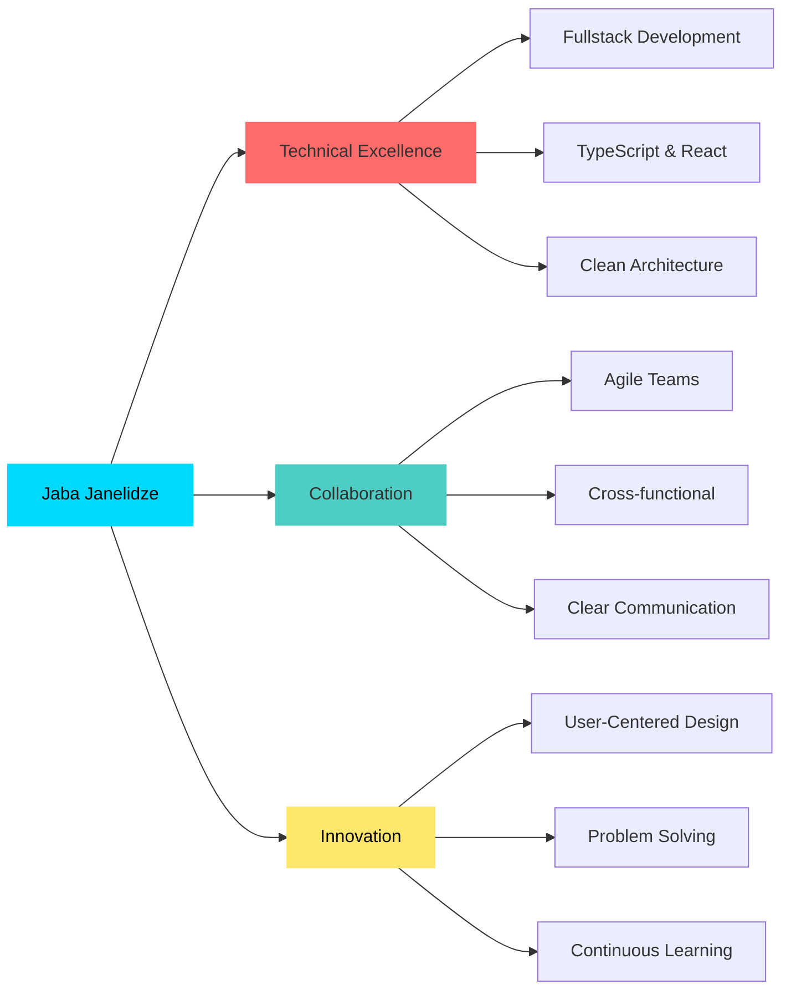

<div align="center">
  
</div>

<div align="center">
  
</div>

<div align="center">
  
  
  
  
</div>

<br/>

<div align="center">
  
</div>

---

## 🎯 **Impact-Driven Developer**

<table>
<tr>
<td width="50%" valign="top">

### 💼 **Professional Snapshot**

```typescript
interface Developer {
  name: string;
  location: string;
  role: string;
  experience: string;
  motto: string;
}

const jaba: Developer = {
  name: "Jaba Janelidze",
  location: "Tbilisi, Georgia 🇬🇪",
  role: "Fullstack Developer",
  experience: "1+ year",
  motto: "Clean code, seamless UX ⚡"
};

// My superpower? Turning complex ideas
// into intuitive, responsive web experiences
```

</td>
<td width="50%" valign="top">

### 🏆 **Achievement Highlights**

<div align="center">

| Area | Expertise |
|------|-----------|
| 🎨 Frontend | React, TypeScript, Angular |
| 🔧 Backend | Node.js, Express, Firebase |
| 🎯 Focus | User-Centered Design |
| 🚀 Approach | Agile & Collaborative |
| 🌐 Languages | 4 Languages (C2-Native) |

</div>

**"From design to deployment—building experiences that matter."**

</td>
</tr>
</table>

---

## 🚀 **Tech Arsenal**

<details open>
<summary><b>🎨 Frontend Core</b></summary>
<br/>

<div align="center">


</div>
</details>

<details open>
<summary><b>⚛️ Frameworks & Libraries</b></summary>
<br/>

<div align="center">


</div>
</details>

<details open>
<summary><b>🔄 State & Data Management</b></summary>
<br/>

<div align="center">


</div>
</details>

<details open>
<summary><b>🎨 Design & UI/UX</b></summary>
<br/>

<div align="center">


</div>
</details>

<details open>
<summary><b>🛠️ Tools & Other Technologies</b></summary>
<br/>

<div align="center">


</div>
</details>

---

## 💡 **What I Bring to Your Team**

<div align="center">



</div>

<div align="center">
<table>
<tr>
<td width="33%" align="center">


**Problem-Solving** • **Full Stack Development**  
**API Integration** • **Responsive Design**  
**Agile Methodology** • **Version Control**

</td>
<td width="33%" align="center">


**Team Player** • **Cross-functional Work**  
**Client Communication** • **Project Management**  
**Business Analysis** • **Documentation**

</td>
<td width="33%" align="center">


**Growth-Oriented** • **Detail-Focused**  
**Innovative Thinker** • **User-Centered**  
**Continuous Learner** • **Quality Advocate**

</td>
</tr>
</table>
</div>

---

## 📊 **GitHub Analytics**

<div align="center">
  
  
</div>

<div align="center">
  
  
</div>

<div align="center">
  
</div>

---

## 💼 **Professional Journey**

<div align="center">

### **Fullstack Developer** • 1+ Year of Innovation

</div>

<table>
<tr>
<td width="50%">

#### 🎯 **Current & Recent Roles**

**Re:Invent** (Mar 2025 – Oct 2025)
- 🤖 Contributing to Georgian AI virtual assistant
- 🎨 Building responsive web platforms
- 🔧 Full-stack development with React & Node.js
- 👥 Cross-functional collaboration

**Resoft** (Oct 2024 – Mar 2025)
- ⚛️ Developed interactive React applications
- 📊 Transitioned to Business Analyst role
- 🚀 Agile team collaboration

</td>
<td width="50%">

#### 🏆 **Key Achievements**

- ✨ Built user-focused web applications
- 🎯 Analyzed user needs & shaped roadmaps
- 💡 Delivered seamless UX across projects
- 🌐 Maintained responsive, accessible UIs
- 🔄 Collaborated with designers & PMs
- 📈 Contributed to AI-based solutions

</td>
</tr>
</table>

---

## 🎓 **Education & Learning**

<div align="center">

| Degree | Institution | Year |
|--------|-------------|------|
| 🎓 Master of IT Technology | Georgian Technical University | 2025 (Expected) |
| 🎓 Bachelor of Science in Geology | Ilia State University | 2024 |

</div>

### 📚 **Certifications & Courses**

<div align="center">


</div>

- **CS50: Introduction to Computer Science** - Harvard University *(Ongoing)*
- **Modern JavaScript (ES6+) Bootcamp** - Udemy
- **HTML/CSS/JavaScript/Angular Bootcamp** - IT Step Academy

---

## 🌍 **Languages**

<div align="center">

| Language | Proficiency |
|----------|-------------|
| 🇬🇪 Georgian | Native |
| 🇬🇧 English | C2 (Proficient) |
| 🇷🇺 Russian | C1 (Advanced) |
| 🇸🇪 Swedish | A2 (Elementary) |

</div>

---

## 🎨 **Featured Projects**

<div align="center">

<a href="https://github.com/jabjubinski">
  
</a>

### 🚀 Check out my repositories to see what I'm building!

**Portfolio Website** • Interactive, responsive showcase of my work  
**AI Assistant Platform** • Contributing to Georgian AI virtual assistant  
**And more projects in progress...**

</div>

---

## 📬 **Let's Connect & Collaborate**

<div align="center">

[](https://linkedin.com/in/jaba-janelidze-2517b0389/)
[](https://github.com/jabjubinski)
[](mailto:jabajnldz.dev@gmail.com)
[](tel:+995595339391)

</div>

<div align="center">
  <br/>
  
</div>

---

<div align="center">

### 💬 **Open to Opportunities**

I'm currently open to fullstack development roles, freelance projects, and exciting collaborations.  
Let's build something amazing together! 🚀

**Specializing in:** React • TypeScript • Node.js • User-Centered Design • Agile Development

</div>

<div align="center">
  
</div>

<div align="center">
  
**⭐ From [jabjubinski](https://github.com/jabjubinski) • Made with 💙 and lots of ☕**

</div>
